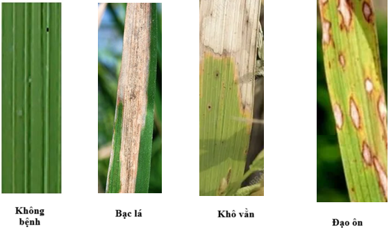
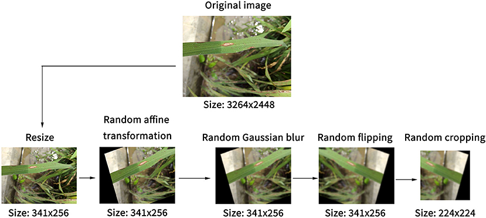
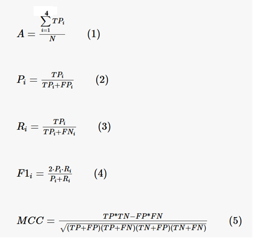

# ĐỀ CƯƠNG NGHIÊN CỨU

## TÊN ĐỀ TÀI (IN HOA)  
CHẨN ĐOÁN BỆNH CÂY LÚA DỰA TRÊN MÔ HÌNH HỌC SÂU

## TÊN ĐỀ TÀI TIẾNG ANH (IN HOA)  
RICE DISEASE DIAGNOSIS USING DEEP LEARNING

---

## TÓM TẮT (Tối đa 400 từ)  
Nông nghiệp là ngành kinh tế quan trọng tại Việt Nam, đóng góp lớn vào GDP và đảm bảo an ninh lương thực. Tuy nhiên, các bệnh trên cây trồng gây thiệt hại nghiêm trọng về năng suất và chất lượng nông sản. Thật vây, theo FAO, mỗi năm, khoảng 20-40% sản lượng cây trồng toàn cầu bị mất do sâu bệnh, gây tổn thất kinh tế khoảng 220 tỷ USD. Trong bài viết của Bộ Nông Nghiệp và Phát triển Nông Thôn về cuộc chiến với bệnh đạo ôn cây lúa, một loại nấm có khả năng phá hủy đến 30% sản lượng gạo thế giới mỗi năm,  đã cho thấy rằng tại Việt Nam, các bệnh phổ biến trên cây lúa không chỉ ảnh hưởng đến năng suất mà còn làm giảm thu nhập của nông dân. Việc phát hiện sớm và chính xác các bệnh trên cây lúa là một thách thức lớn, đặc biệt trong bối cảnh biến đổi khí hậu và sự gia tăng của các loại bệnh mới. Đề tài này tập trung vào việc xây dựng một hệ thống sử dụng Deep Learning để chẩn đoán bệnh trên lá cây lúa thông qua hình ảnh và chọn  EfficientNet làm kiến trúc CNN, nhờ khả năng cân bằng giữa độ chính xác cao và hiệu quả tài nguyên. Hệ thống sẽ được huấn luyện trên  22,031 hình ảnh dữ liệu công khai và dữ liệu thực địa tại Việt Nam, tập trung vào các bệnh phổ biến trên cây lúa như bệnh đạo ôn, bệnh bạc lá, và bệnh khô vằn. Kết quả dự kiến bao gồm một mô hình đạt độ chính xác trên 90% trong việc phân loại bệnh trên lá cây lúa, một giao diện web thân thiện với người dùng.

---

## GIỚI THIỆU  

Trong bối cảnh chuyển đổi số đang diễn ra mạnh mẽ, ngành nông nghiệp Việt Nam đang đứng trước cơ hội lớn để áp dụng các công nghệ tiên tiến nhằm nâng cao năng suất và chất lượng sản xuất. Theo Bộ Khoa học và Công nghệ, trong khuôn khổ TECHFEST Việt Nam 2025, Hội thảo “Nông nghiệp công nghệ cao cho tăng trưởng xanh”, việc xây dựng hệ sinh thái đổi mới sáng tạo cho nông nghiệp không chỉ giúp tăng trưởng xanh mà còn thúc đẩy sự phát triển bền vững của ngành. Các công nghệ như trí tuệ nhân tạo, học máy và học sâu đang được ứng dụng rộng rãi để giải quyết các vấn đề phức tạp trong nông nghiệp, bao gồm dự đoán năng suất, tối ưu hóa chuỗi cung ứng, giúp tối ưu hóa gieo sạ, phun thuốc, bón phân và quản lý đồng ruộng và chẩn đoán bệnh cây trồng. Trong bối cảnh này, việc phát triển các hệ thống tự động để hỗ trợ nông dân phát hiện và xử lý bệnh cây trồng một cách nhanh chóng và chính xác là một nhu cầu cấp thiết.  

Đề tài "Chẩn đoán bệnh cây lúa dựa trên ảnh lá cây" tập trung vào việc xây dựng một hệ thống sử dụng học sâu để phát hiện và phân loại các bệnh phổ biến trên cây lúa. Dựa trên nghiên cứu "Automatic Diagnosis of Rice Diseases Using Deep Learning" (2021), EfficientNet được chọn làm kiến trúc CNN chính nhờ khả năng cân bằng giữa độ chính xác cao và hiệu quả tài nguyên. EfficientNet không chỉ giúp cải thiện độ chính xác trong việc phân loại bệnh mà còn phù hợp để triển khai trên các thiết bị có cấu hình thấp, giúp nông dân dễ dàng sử dụng ngay tại thực địa. 

Hệ thống này sử dụng ảnh lá cây lúa được chụp từ thực địa  và các nguồn dữ liệu công khai. Các ảnh này sẽ bao gồm các triệu chứng của các bệnh phổ biến như bệnh đạo ôn, bệnh bạc lá, và bệnh khô vằn. Kết quả đầu ra của hệ thống bao gồm tên bệnh, mức độ nghiêm trọng, và các gợi ý xử lý. Hệ thống sẽ hỗ trợ nông dân phát hiện bệnh một cách nhanh chóng và đưa ra các biện pháp xử lý kịp thời, góp phần nâng cao hiệu quả sản xuất nông nghiệp và đảm bảo an ninh lương thực quốc gia.

---

## MỤC TIÊU (Viết trong vòng 3 mục tiêu)  

1. Xây dựng và cải tiến mô hình EfficientNet để phân loại bệnh trên lá cây lúa với độ chính xác cao hơn 90%.
2. Tích hợp khả năng đánh giá mức độ nghiêm trọng của bệnh (severity level) bên cạnh việc phân loại tên bệnh, nhằm cung cấp thông tin chi tiết hơn cho nông dân và các chuyên gia nông nghiệp.  

3. Tối ưu hóa mô hình để có thể triển khai trên các thiết bị di động hoặc các hệ thống có cấu hình thấp, giúp tăng tính ứng dụng thực tế và khả năng tiếp cận của hệ thống đối với nông dân ở các vùng nông thôn.   

---

## NỘI DUNG VÀ PHƯƠNG PHÁP  
### Nội dung:  
1. Thu thập dữ liệu ảnh lá cây lúa từ các nguồn công khai và thực địa tại Việt Nam.  

Quá trình thu thập dữ liệu ảnh lá cây lúa được thực hiện theo hai hướng chính: từ các nguồn công khai và từ thực địa tại Việt Nam. Đầu tiên, các bộ dữ liệu công khai Kaggle được sử dụng để thu thập ảnh lá cây lúa. Trên các nền tảng này, các bộ dữ liệu liên quan đến bệnh cây lúa được tìm kiếm bằng các từ khóa như "rice leaf disease" hoặc "rice blast dataset". Sau khi tải xuống, dữ liệu được kiểm tra và lọc để loại bỏ các ảnh không liên quan hoặc không đạt chất lượng, đảm bảo bao gồm đầy đủ các triệu chứng của ba loại bệnh phổ biến (bệnh đạo ôn, bệnh bạc lá, và bệnh khô vằn) cũng như lá không bệnh. Bên cạnh đó, dữ liệu thực địa được thu thập từ các vùng trồng lúa lớn tại Việt Nam như Đồng bằng sông Cửu Long. Tại đây, ảnh lá cây lúa được chụp bằng máy ảnh hoặc điện thoại thông minh có độ phân giải cao, trong điều kiện ánh sáng tự nhiên để đảm bảo chất lượng. Các ảnh được chụp từ nhiều góc độ khác nhau để tăng tính đa dạng và đại diện của dữ liệu. Quá trình thu thập này nhằm xây dựng một tập dữ liệu đầy đủ và cân bằng, phục vụ cho việc huấn luyện và đánh giá mô hình EfficientNet.

2. Tiền xử lý dữ liệu, bao gồm gắn nhãn và chia tập dữ liệu.  

Quá trình tiền xử lý dữ liệu bao gồm việc phân loại và gắn nhãn các ảnh lá cây lúa thành bốn nhóm chính: lá không bệnh, lá bị bệnh đạo ôn, lá bị bệnh bạc lá, và lá bị bệnh khô vằn. 

Sau đó, các ảnh không đạt yêu cầu như ảnh mờ, thiếu sáng hoặc không rõ triệu chứng sẽ được loại bỏ. Tất cả các ảnh được chuẩn hóa về kích thước 224x224 pixel để phù hợp với đầu vào của mô hình EfficientNet. Tiếp theo, các kỹ thuật tăng cường dữ liệu như xoay ảnh, lật ảnh, thay đổi độ sáng được áp dụng để tăng tính đa dạng và giảm nguy cơ overfitting. 

Cuối cùng, dữ liệu được chia thành ba tập: tập huấn uyện (70%), tập kiểm định (20%), và tập kiểm tra (10%), đảm bảo tính cân bằng giữa các lớp và tính đại diện của dữ liệu.

---

3. Huấn luyện mô hình EfficientNet với các phiên bản như EfficientNet-B0 và B3.

Quá trình huấn luyện mô hình EfficientNet được thực hiện với hai phiên bản EfficientNet-B0 và EfficientNet-B3. EfficientNet-B0, với cấu trúc nhẹ, phù hợp cho các thiết bị cấu hình thấp, trong khi EfficientNet-B3, phức tạp hơn, được tối ưu hóa cho các hệ thống có GPU mạnh, giúp cải thiện độ chính xác. Mô hình sử dụng kỹ thuật Transfer Learning, tận dụng các trọng số đã được huấn luyện trước trên tập dữ liệu ImageNet, và thay thế phần Fully Connected Layer bằng các lớp Dense phù hợp với bài toán phân loại 4 lớp (3 loại bệnh và lá không bệnh). Để tránh hiện tượng overfitting, kỹ thuật Early Stopping được áp dụng, dừng huấn luyện khi hiệu suất trên tập kiểm định không còn cải thiện. Sau khi huấn luyện, mô hình được đánh giá trên tập kiểm tra bằng các chỉ số như Accuracy, Precision, Recall, F1-score, và Matthews Correlation Coefficient (MCC). Hiệu suất của hai phiên bản EfficientNet-B0 và EfficientNet-B3 được so sánh để chọn ra mô hình tối ưu nhất, sẵn sàng triển khai trên giao diện web demo, hỗ trợ người dùng chẩn đoán bệnh cây lúa một cách nhanh chóng và chính xác.

4. Đánh giá hiệu suất mô hình bằng các chỉ số như Accuracy, Precision, Recall, F1-score, và Matthews Correlation Coefficient (MCC)

Quá trình đánh giá hiệu suất mô hình được thực hiện trên tập kiểm tra, chiếm 10% tổng dữ liệu, đảm bảo tính cân bằng giữa các lớp (3 loại bệnh và lá không bệnh). Các chỉ số được sử dụng để đánh giá bao gồm Accuracy, Precision, Recall, F1-score, và Matthews Correlation Coefficient (MCC). Accuracy đo lường tỷ lệ dự đoán đúng trên tổng số mẫu, trong khi Precision và Recall lần lượt đánh giá độ chính xác của các dự đoán và khả năng phát hiện đúng các mẫu thuộc lớp thực tế. F1-score, trung bình điều hòa giữa Precision và Recall, giúp đánh giá hiệu suất tổng thể của mô hình. MCC, một chỉ số tương quan, cung cấp cái nhìn toàn diện về mối quan hệ giữa dự đoán và nhãn thực tế. Quy trình đánh giá bao gồm việc dự đoán nhãn trên tập kiểm tra, tính toán các chỉ số, và tạo ma trận nhầm lẫn để trực quan hóa các dự đoán đúng và sai. Hiệu suất của hai phiên bản EfficientNet-B0 và EfficientNet-B3 được so sánh để chọn ra mô hình tối ưu nhất với mục tiêu đạt độ chính xác trên 90% và đảm bảo tính ứng dụng thực tế.

Trong đó:
- True Positive (TP): Dự đoán đúng loại bệnh (ví dụ: bệnh đạo ôn được dự đoán chính xác là bệnh đạo ôn).
- False Positive (FP): Dự đoán sai, khi một loại bệnh khác được dự đoán là loại bệnh này (ví dụ: bệnh bạc lá bị dự đoán nhầm là bệnh đạo ôn).
- True Negative (TN): Dự đoán đúng rằng bệnh không phải là loại bệnh khác (ví dụ: bệnh đạo ôn không bị dự đoán nhầm là bệnh bạc lá).
- False Negative (FN): Dự oán sai, khi loại bệnh này bị dự đoán thành loại bệnh khác hoặc không bệnh (ví dụ: bệnh đạo ôn bị dự đoán nhầm là không bệnh).
- N: Số lượng ảnh được đem huấn luyện
- i: số thứ bệnh (0- bình thường,1-đạo ôn,2-bạc lá,3-khô vằn)

---

## KẾT QUẢ MONG ĐỢI  

Đề tài hướng đến việc xây dựng một hệ thống chẩn đoán bệnh cây lúa dựa trên ảnh lá cây, sử dụng mô hình EfficientNet với độ chính xác cao và khả năng ứng dụng thực tế. Kết quả mong đợi bao gồm một mô hình đạt độ chính xác trên 99% trong việc phân loại 4 lớp (3 loại bệnh phổ biến: bệnh đạo ôn, bệnh bạc lá, bệnh khô vằn và lá không bệnh), vượt trội so với các nghiên cứu trước đây. Hệ thống không chỉ dừng lại ở việc phân loại tên bệnh mà còn đánh giá mức độ nghiêm trọng của bệnh, cung cấp thông tin chi tiết và các gợi ý xử lý phù hợp cho nông dân.  

Bên cạnh đó, mô hình được tối ưu hóa để triển khai trên các thiết bị di động hoặc hệ thống có cấu hình thấp, đảm bảo khả năng tiếp cận cao, đặc biệt ở các vùng nông thôn. Một giao diện web demo thân thiện sẽ được phát triển, cho phép người dùng tải ảnh lá cây lúa và nhận kết quả chẩn đoán nhanh chóng. Hệ thống này kỳ vọng sẽ hỗ trợ nông dân phát hiện bệnh kịp thời, đưa ra các biện pháp xử lý hiệu quả, góp phần nâng cao năng suất nông nghiệp và đảm bảo an ninh lương thực quốc gia.

---

## TÀI LIỆU THAM KHẢO (Định dạng DBLP)  

[1]. FAO: The hidden health crisis: How plant diseases threaten global food security.  

[2]. MARD: Đột phá trong cuộc chiến chống lại bệnh đạo ôn.

[3] Bộ khoa học & công nghệ: Xây dựng hệ sinh thái đổi mới sáng tạo cho nông nghiệp tăng trưởng xanh

[3]. Author(s): Ruoling Deng, Ming Tao, Hang Xing, Xiuli Yang, Chuang Liu, Kaifeng Liao, Long Qi:  
Automatic Diagnosis of Rice Diseases Using Deep Learning, 2021.  
DOI: [10.3389/fpls.2021.701038](https://www.frontiersin.org/articles/10.3389/fpls.2021.701038/full)  

[4]. Author(s):  Utkarsh Mishra, Ansh Pandey, Logeswari G & Tamilarasi K  
Deep learning-based disease detection in potato and mango leaves: a comparative study of CNN, AlexNet, ResNet, and EfficientNet. Scientific Reports, Nature, 2025.  
DOI: [10.1038/s41598-025-32607-5](https://www.nature.com/articles/s41598-025-32607-5)  

[5]. Author(s):  Jyotika, Prof. Ramesh Patil  
Crop Disease Detection Enhancement via EfficientNet and Convolutional Group-Wise Transformer Integration. International journal of Engineering sciences and Advanced Technology, 2025.  
URL: [https://ijesat.com/ijesat/files/V25I7029_1752217686.pdf](https://ijesat.com/ijesat/files/V25I7029_1752217686.pdf)  

[6]. Author(s):  Nahrin Jannat, S.M. Mahedy Hasan, Minhaz F. Zibran  
A novel ensemble approach for crop disease detection by leveraging customized EfficientNets and interpretability, Elsevier, 2025.  
DOI: [10.1016/j.patrec.2025.02.006](https://www.sciencedirect.com/science/article/abs/pii/S0167865525002600)
